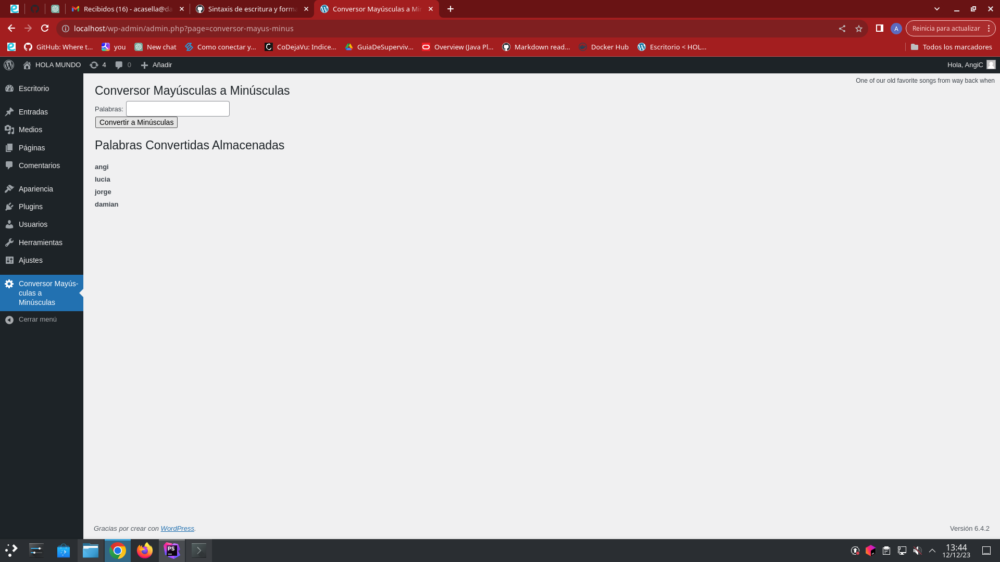
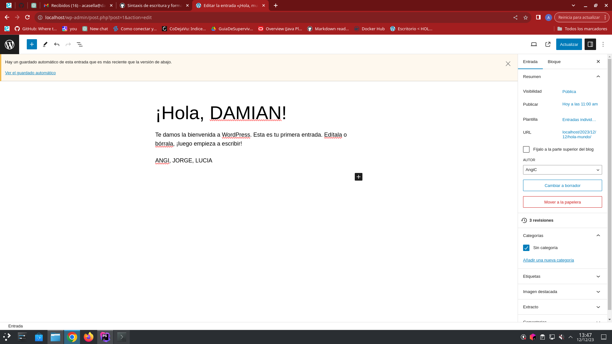
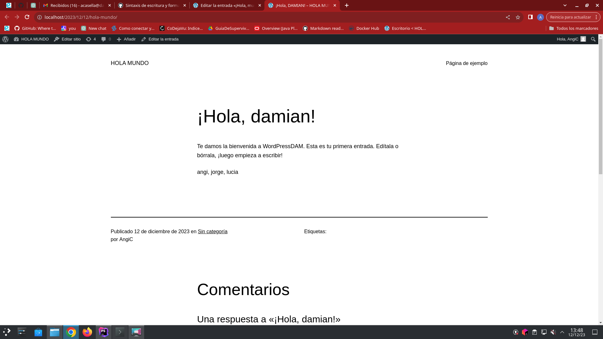

# Conversor Mayúsculas a Minúsculas - Plugin de WordPress

## Descripción
Este plugin proporciona una funcionalidad sencilla pero útil para convertir palabras 
de mayúsculas a minúsculas en el contenido y los títulos de las publicaciones de WordPress. Además, permite ingresar nuevas palabras para su conversión y muestra las palabras convertidas almacenadas.

## Instalación
1. Descarga el archivo ZIP del plugin.
2. Ve a tu panel de administración de WordPress.
3. Navega a "Plugins" > "Añadir nuevo" > "Subir plugin".
4. Selecciona el archivo ZIP descargado y haz clic en "Instalar ahora".
5. Activa el plugin después de la instalación.

> [!NOTE]
> Al trabajar con Docker, el plugin debe instalarse en la carpeta wp-content/plugins del contenedor de WordPress
> para que se pueda acceder a él desde el panel de administración. Debemos arrancar el contenedor.

## Uso
El plugin agrega un menú llamado "Conversor Mayúsculas a Minúsculas" en el panel de 
administración. Desde allí, puedes ingresar nuevas palabras para convertirlas a minúsculas 
y ver las palabras convertidas almacenadas.

## Funcionalidades Principales
### Conversión de palabras
El formulario en la página del plugin permite ingresar palabras y convertirlas a minúsculas.
Las palabras ingresadas se almacenan en la base de datos para su posterior referencia.
```
// Procesar el formulario de conversión
if ($_SERVER['REQUEST_METHOD'] === 'POST' && isset($_POST['submit'])) {
    $palabras = sanitize_text_field($_POST['palabras']);
    // Convertir a minúsculas
    $palabras_minusculas = strtolower($palabras);
    // Insertar en la base de datos
    $wpdb->insert($tabla_conversor, array('palabras' => $palabras_minusculas));
}
```
### Visualización de Palabras Convertidas
El plugin muestra las palabras convertidas almacenadas en una lista en la interfaz del 
panel de administración.
```
// Mostrar palabras convertidas almacenadas
$palabras_convertidas = $wpdb->get_results("SELECT * FROM $tabla_conversor", ARRAY_A);
foreach ($palabras_convertidas as $entrada) {
    echo '<li><strong>' . esc_html($entrada['palabras']) . '</strong></li>';
}
```

### Aplicación en Contenido y Títulos de Publicaciones
El plugin utiliza filtros para aplicar la conversión de palabras en el contenido y los 
títulos de las publicaciones.
```
// Agregar filtro para el contenido del post
add_filter('the_content', 'aplicar_conversor_en_contenido');

// Agregar filtro para el título del post
add_filter('the_title', 'aplicar_conversor_en_titulo');
```

## Base de Datos
Al activar el plugin, se crea una tabla llamada 'wp_conversor_palabras' en la base de 
datos para almacenar las palabras convertidas.
```
// Acción para crear las tablas en la base de datos al activar el plugin
register_activation_hook(__FILE__, 'crear_tablas');
```

## Captura de pantalla





### ¡Disfruta de la funcionalidad simple pero efectiva de Conversor Mayúsculas a Minúsculas en tu sitio de WordPress!